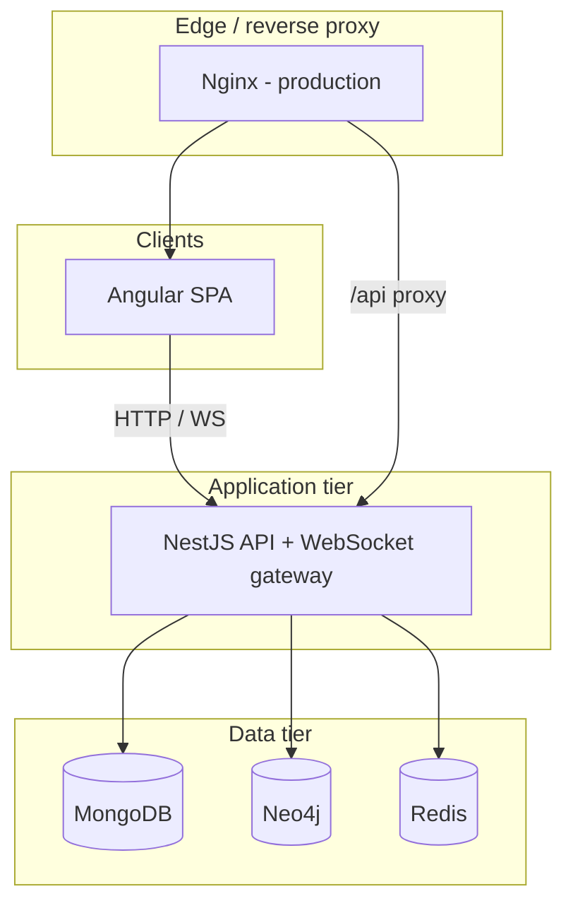

# Connect — Architecture & Technical Design

This document describes the **system architecture**, **why MongoDB, Neo4j, and Redis were chosen together**, what each store is responsible for, and how that maps to **product features**. It is written for a NoSQL course context: the goal is **polyglot persistence** — using each database for what it does best, not comparing “which DB wins” in isolation.

---

## 1. Executive summary

**Connect** is a social network with feeds, reactions, comments, stories, private messaging, groups, friend relationships, suggestions, and notifications. The backend is **NestJS**; the frontend is **Angular**; data is split across:

| Store      | Primary strength used in this project                         |
|-----------|------------------------------------------------------------------|
| **MongoDB** | Rich **documents** (posts, nested comments, conversations, user profiles) |
| **Neo4j**   | **Graph** queries (friends, requests, group membership, recommendations)   |
| **Redis**   | **Low-latency** ephemeral state (cache, sessions, unread counts, JWT blacklist) |

Together they form a **complementary** stack: MongoDB holds authoritative **content**, Neo4j holds authoritative **social topology**, Redis accelerates **hot paths** and **cross-request state** that would be awkward or slow to model purely in MongoDB or Neo4j.

---

## 2. High-level architecture

**Request path (simplified):**

1. User authenticates → JWT issued; optional session / blacklist keys in **Redis**.
2. Friend actions → **Neo4j** graph updated; feed cache may be invalidated in **Redis**.
3. Posts, comments, messages, stories → **MongoDB** as source of truth documents.
4. Feed read → may be served from **Redis** cache after friend list from **Neo4j** drives the MongoDB query.

---

## 3. Technology stack

| Layer | Technology | Role |
|-------|------------|------|
| UI | **Angular 18** (standalone components, signals where used) | SPA: feed, profiles, messages, groups, auth |
| API | **NestJS 10** (TypeScript) | REST + guards + WebSockets (`socket.io`) |
| Auth | **JWT** (`@nestjs/jwt`, Passport) | Stateless bearer tokens |
| Real-time | **Socket.IO** | Chat events, optional notification push to connected clients |
| Documents | **MongoDB 7** + **Mongoose** | Users, posts, nested comments/replies, conversations, stories, notifications |
| Graph | **Neo4j 5 Community** + **neo4j-driver** | Users/Groups nodes, FRIENDS, FRIEND_REQUEST, MEMBER_OF, OWNS |
| Cache / ephemeral | **Redis 7** + **ioredis** | Feed cache keys, per-conversation unread counters, JWT blacklist, session hints |
| Containers | **Docker Compose** | One-command local stack |

---

## 4. Functional map (what the app does)

### 4.1 Identity & profiles

- Register / login / logout.
- User profile: display name, bio, avatar, cover banner, optional fields (address, city, workplace, website).
- Public vs own profile views; friend-only visibility for some profile data (e.g. friend list / feed of another user when policy requires friendship).

**Primary stores:** MongoDB (user document), Neo4j (User node kept in sync for graph operations).

### 4.2 Social graph (friends)

- Send / accept / reject friend requests.
- List friends, pending inbound, pending outbound.

**Primary store:** **Neo4j** — relationships are first-class (`FRIEND_REQUEST`, `FRIENDS`). Traversals (“friends of friends”) are one or two hops in Cypher.

**Secondary:** MongoDB user collection for rich profile fields; graph stores stable `id` references to MongoDB `_id` strings.

### 4.3 Feed & engagement

- Create posts (text + optional media URLs after upload).
- Reactions on posts; comments; replies to comments; reaction detail modal (who reacted with what).

**Primary store:** **MongoDB** — post is a natural document with embedded arrays (`reactions`, `comments` with nested `replies`).

**Acceleration:** **Redis** — feed responses can be cached per user/page to reduce repeated MongoDB aggregation under load.

### 4.4 Stories

- Short-lived content (e.g. 24h) with media or text.

**Primary store:** **MongoDB** — TTL index on `expiresAt` fits ephemeral document lifecycle.

### 4.5 Messaging

- Private conversations between friends; text / image / video messages.
- Unread counts; mark read when opening a thread.
- Real-time delivery via WebSockets.

**Primary store:** **MongoDB** — conversation document with embedded `messages` array (simple to reason about for a course scope).

**Ephemeral / fast:** **Redis** — unread counters per `(conversationId, userId)` for quick badge updates without scanning all messages on every navigation.

### 4.6 Groups

- Create group; join / leave; list members; group-scoped posts.

**Split model:** **Neo4j** for membership and ownership edges (`MEMBER_OF`, `OWNS`); **MongoDB** for group metadata document and **posts** tagged with `groupId`.

### 4.7 Recommendations (“Personnes que vous connaissez peut-être”)

- **`GET /friends/suggestions`** runs **two Cypher queries** in Neo4j, merges results in the service, ranks, then hydrates profiles from MongoDB.

**Signal 1 — Friend-of-friend (primary):**  
`(me)-[:FRIENDS]-(friend)-[:FRIENDS]-(suggested)`  
Exclude `suggested` if already `FRIENDS`, or any pending `FRIEND_REQUEST` in either direction.  
Rank by **`count(DISTINCT friend)`** = number of mutual friends (2-hop strength).

**Signal 2 — Same groups (secondary):**  
`(me)-[:MEMBER_OF]->(group)<-[:MEMBER_OF]-(suggested)`  
Same exclusions. Rank by **`count(DISTINCT group)`** = shared group count.

**Merge & sort:** For each `suggested` user id, keep both scores when applicable. Sort by **mutual friends descending**, then **shared groups descending**, then stable tie-break on id. Cap at 25 results.

**Response fields:** `mutualFriends`, `sharedGroups`, `recommendationReason` ∈ `{ mutual_friends, shared_groups, both }` for UI copy.

**Primary store:** **Neo4j** for topology and ranking; **MongoDB** only for display fields (`UsersService.findById` + `toPublic()`).

**UI:** Right sidebar (“Vous connaissez peut-être…”) and **Amis → Suggestions** tab with a short explanation of the graph-based logic.

### 4.8 Notifications

- Events such as reactions, comments, new messages can create notification documents and optionally push over WebSocket to online users.

**Primary store:** **MongoDB** (notification documents) for persistence and listing.

---

## 5. Why MongoDB — and what it stores here

### 5.1 What MongoDB is best at (relevant to this project)

- **Flexible schema** for content that evolves (e.g. new optional fields on users, new media types on posts).
- **Document locality**: a post with comments and reactions is read and updated as **one aggregate** — few round-trips, natural mapping to application objects.
- **Horizontal scaling story** for high-volume feeds (sharding) — relevant if the product grew.
- **TTL indexes** for stories — automatic expiry without application cron jobs.

### 5.2 Concrete usage in Connect

| Collection / model | Responsibility |
|--------------------|----------------|
| `User` | Profile, credentials hash, extended profile fields |
| `Post` | Feed/group posts, embedded reactions & comments |
| `Conversation` | DM threads + embedded messages |
| `Story` | Ephemeral stories + TTL |
| `Notification` | In-app notification feed |
| `Group` (metadata) | Name, description, link to Neo4j graph id |

### 5.3 Why not *only* MongoDB for everything?

You *could* store friend edges as two arrays per user (`friends[]`, `requests[]`). That becomes painful for:

- “Friends of friends excluding existing friends” (multi-hop, deduplication, anti-join logic in application code).
- Global integrity (“no duplicate pending request in both directions”) without careful transactional updates across two user documents.

Neo4j keeps **relationship semantics** explicit and queryable in a few lines of Cypher.

---

## 6. Why Neo4j — and what it stores here

### 6.1 What Neo4j is best at (relevant to this project)

- **Relationship-first modeling**: friends, pending requests, group membership are inherently a **graph**.
- **Declarative traversals**: patterns like `(me)-[:FRIENDS]-(friend)-[:FRIENDS]-(candidate)` are the native language of the product.
- **Recommendations / discovery** that are naturally expressed as **path queries** and **counts along paths** (mutual friends, shortest connection, etc.).

### 6.2 Concrete usage in Connect

| Graph element | Meaning |
|---------------|---------|
| `(:User {id})` | Logical user (id mirrors MongoDB user id) |
| `(:Group {id})` | Logical group (id mirrors Mongo group / UUID strategy in code) |
| `[:FRIEND_REQUEST]` | Pending directed request |
| `[:FRIENDS]` | Undirected friendship (modeled as one edge pattern in queries) |
| `[:MEMBER_OF]` | User membership in a group (with role property where used) |
| `[:OWNS]` | Owner of a group |

### 6.3 Why Neo4j for recommendations (example)

**Friend-of-friend suggestion** is a small subgraph problem:

- Start from `me`, expand to friends `f`, expand to `candidate`, exclude people already friends or already in a request relationship, rank by **count of distinct mutual friends**.

In a relational DB this is multiple self-joins and grouping. In MongoDB it is often **application-side iteration** or a heavy aggregation pipeline. In Neo4j it maps closely to **how humans think about the question**, and the query planner optimizes traversals.

### 6.4 Why not *only* Neo4j for posts and messages?

Neo4j can store blobs of text as node properties, but:

- Large comment threads and media metadata are **hierarchical documents**, not graph traversals.
- Feed retrieval is “latest documents by author in set S” — a **document DB** or search index is typically simpler and cheaper.

So Neo4j is used where the **topology** is the product; MongoDB where the **content tree** is the product.

---

## 7. Why Redis — and what it stores here

### 7.1 What Redis is best at (relevant to this project)

- **Sub-millisecond reads/writes** for small keys.
- **TTL** on keys (session-like data, temporary counters).
- **Pattern invalidation** (e.g. `feed:*`) when content changes.
- **Atomic increments** for unread message counts.

### 7.2 Concrete usage in Connect

| Key pattern (conceptual) | Purpose |
|--------------------------|---------|
| `feed:{userId}:{page}` | Cached JSON feed snapshot (short TTL) |
| `session:{userId}` | Optional session marker / token fingerprint |
| `blacklist:{jwt}` | Logout / forced invalidation before JWT expiry |
| `unread:{conversationId}:{userId}` | Unread message counter for badges |

### 7.3 Why not skip Redis?

Without Redis:

- Every feed load might hit MongoDB + friend resolution even when nothing changed.
- Unread badges might require scanning message arrays or maintaining heavy counters in MongoDB on every read.

Redis is the **right tool for ephemeral, high-churn, small data** that should not clutter the document model or the graph.

---

## 8. Why this *three-database* solution (together)

This is **polyglot persistence**: one service, multiple specialized stores.

**Design principle:**  
> Store each piece of data in the engine whose **query pattern** and **consistency model** match how the feature is accessed.

- **Content & timelines as documents** → MongoDB  
- **Social topology & discovery** → Neo4j  
- **Hot cache & ephemeral counters** → Redis  

**Operational tradeoff:** you operate three data systems instead of one. For a **NoSQL course project**, that is intentional: it demonstrates understanding of **when to combine** stores. In production at scale, the same split appears (often plus Elasticsearch/OpenSearch for search).

---

## 9. Architectural decision “benchmark” (evaluation matrix)

This is **not** a latency benchmark (that would require a fixed dataset, hardware, and reproducible load tests). It is a **structured comparison** of alternative architectures against the same feature set.

### 9.1 Criteria

| Criterion | Weight (importance) | Notes |
|-----------|---------------------|-------|
| Friend graph queries | High | Multi-hop, dedupe, requests |
| Feed & nested comments | High | Document shape |
| Real-time / unread UX | Medium | Counters, cache |
| Operational simplicity | Medium | Fewer moving parts wins |
| Course learning value | High | Demonstrate multiple NoSQL paradigms |

### 9.2 Options compared

| Option | Pros | Cons vs Connect requirements |
|--------|------|--------------------------------|
| **A. MongoDB only** | Single ops story; great documents | Graph queries & recommendations become complex pipelines or app code; harder to express “friend of friend” cleanly |
| **B. Neo4j only** | Excellent graph | Awkward primary store for large post bodies, many comments, binary-ish metadata; modeling a full feed as graph-only is non-idiomatic |
| **C. Redis only** | Extremely fast | Not durable source of truth for profiles/posts; memory-bound; wrong primary store |
| **D. SQL (e.g. Postgres) only** | Strong consistency; joins | Social feed + deep comment trees often lead to many tables & migrations; graph-like recommendations need recursive CTEs — workable but heavier for a NoSQL-focused project |
| **E. MongoDB + Redis (no graph DB)** | Good performance, simpler than 3 DBs | Recommendations and friend topology are **fighting the data model** |
| **F. MongoDB + Neo4j + Redis (chosen)** | Each tier uses a natural model | More components to deploy — acceptable for teaching and realistic for mid/large social products |

**Conclusion:** Option **F** maximizes **model fit per feature** while keeping MongoDB as the **system of record** for content and Neo4j as the **system of record** for relationships — Redis is not a “third source of truth” for business entities; it is a **performance and session layer**.

---

## 10. Example flows (end-to-end)

### 10.1 Send friend request

1. Client `POST /friends/request` with `toUserId`.
2. API validates target user (MongoDB).
3. API writes `FRIEND_REQUEST` edge in **Neo4j** (idempotent `MERGE` pattern).
4. API invalidates **Redis** keys tied to feed cache for involved users (so stale feeds are not served).

### 10.2 Load home feed

1. API reads friend ids from **Neo4j** (`FRIENDS` edges).
2. API checks **Redis** for `feed:{userId}:{page}`.
3. On miss: query **MongoDB** for posts whose `authorId` is in `{self + friends}`, enrich authors, write Redis with short TTL.

### 10.3 Suggested friends

1. **Neo4j query A:** friend-of-friend pattern with `WITH suggested, count(DISTINCT f)`; `ORDER BY mutualCount DESC LIMIT 25`.
2. **Neo4j query B:** shared-group pattern with `count(DISTINCT g)`; same limit and exclusions (`NOT FRIENDS`, `NOT FRIEND_REQUEST` either way).
3. **NestJS `FriendsService.getSuggestions`:** merge scores per `suggestedId`, global sort (mutual friends first, then shared groups), slice top 25.
4. For each id, **MongoDB** loads the user document and returns `toPublic()` + `mutualFriends`, `sharedGroups`, `recommendationReason`.
5. After the user sends a friend request from a suggestion, the client reloads suggestions so the graph exclusions take effect on the next call.

### 10.4 New private message

1. Append message sub-document in **MongoDB** `Conversation`.
2. Increment unread in **Redis** for recipients.
3. Emit WebSocket event to room; optionally create **MongoDB** `Notification` and push to user room.

---

## 11. Backend module map (NestJS)

| Module | Responsibility |
|--------|----------------|
| `auth` | JWT issue/verify; Redis blacklist / session helpers |
| `users` | MongoDB user CRUD; `toPublic()` projection; Neo4j user node sync on create/update name |
| `friends` | Neo4j graph operations + Redis cache invalidation hooks |
| `posts` | MongoDB posts; reactions/comments; optional notifications; Redis feed invalidation |
| `messages` | MongoDB conversations; Redis unread; friend gate via Neo4j |
| `stories` | MongoDB TTL stories |
| `groups` | Neo4j membership + MongoDB group metadata + posts by `groupId` |
| `notifications` | MongoDB notifications; optional WS fan-out |
| `neo4j` | Driver wrapper, constraints |
| `redis` | Client wrapper, helpers (`get`/`set`/`invalidatePattern`) |
| `chat` | WebSocket gateway (JWT on connect, message broadcast) |

---

## 12. Security & deployment notes (brief)

- JWT secret must be overridden in production (`JWT_SECRET`).
- Neo4j credentials are for local dev only in `docker-compose.yml`.
- Nginx in the frontend container proxies `/api` and `/uploads` to the backend in production builds.

---

## 13. Summary one-liner

**MongoDB** owns **what people wrote** (posts, messages, profiles).  
**Neo4j** owns **who is connected to whom** (friends, groups, suggestions).  
**Redis** owns **what should be fast and disposable** (cache, unread, auth/session helpers).

That combination is a **deliberate** polyglot design: each database is used for the class of problems it is **best** at, which keeps queries simple and the domain model honest.
